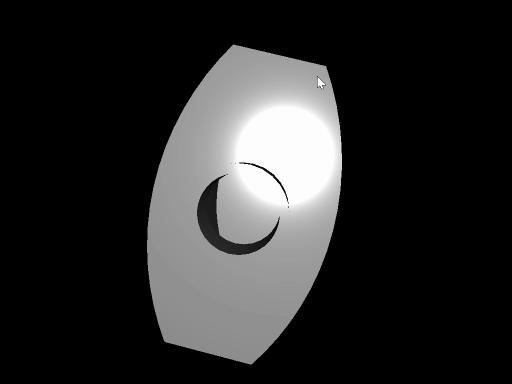

# truck

**Truck is a RUst Cad Kernel!**



*This bottle is based on [this tutorial](https://dev.opencascade.org/doc/overview/html/occt__tutorial.html)
by Open CASCADE Technology (OCCT), a great senior of truck.
The OCCT tutorial properly models the fillets and the threading.
This shows that truck is still in its infancy in terms of functionality.
Our immediate goal for truck is to be able to model this bottle perfectly.*

## Overview

`truck` is an open-source shape processing kernel by Rust. This crate group targets
[B-rep](https://en.wikipedia.org/wiki/Boundary_representation) modeling,
and also maintains some mesh algorithms and a simple renderer.

### Three guiding principles

- **Trendy tools**
  - We are using Rust. We pay special attention to make everything work with WebGPU.
  - We use Cargo's extensive maintenance features to ensure thorough continuous integration.
  - Speed is a priority and that includes WebGPU.
  - Abstraction with trait bound provides a ready implementation of data exchange to various CAD formats.
- **Traditional arts**
  - Instead of creating another binding to one of the existing geometry kernels, we are writing a new B-rep NURBS kernel.
  - We use safe Rust (although we give you the choice of using `unsafe` methods in some instances).
  - It is possible to handle modeling and data exchange (OBJ, STL, and STEP) using the same code in both native and browser environments.
- **Theseus' ship**
  - Functionality is modularized into smaller crates that can be replaced, like
    the parts in [the Ship of Theseus](https://en.wikipedia.org/wiki/Ship_of_Theseus).
  - Based on the many lessons we learned in the past, we have given up on overall
    optimizations that a single library/crate would afford. A collection of
    individual, optimized crates carries less risk and can be made just as efficient.
  - Feature creep usually happens over time. Bundling stuff in smaller crates will help us deal with it.
  - It is possible to implement small-scale web applications like data converter with minimal dependencies.

## License

Apache License 2.0.

## Usage

### Examples

All examples are located under the `examples` folder of each crate.
These examples use the default syntax for running examples, as found in the
[resp. Cargo documentation](https://doc.rust-lang.org/cargo/reference/cargo-targets.html#examples) .

At first, let's run the following example!

```bash
git submodule update --init
cargo run --example rotate-objects
```

### Tutorials

There are some learning resources for using `truck` v0.1.x series.

- [`truck-tutorial`](https://ricos.gitlab.io/truck-tutorial/v0.1/)
- [`truck-tutorial-ja`](https://ricos.gitlab.io/truck-tutorial-ja/v0.1/)
  (Japanese version)
- [`truck-tutorial-code`](https://github.com/ricosjp/truck-tutorial-code/tree/v0.1)
  (sample code for the tutorial)

## Crates

- `truck-base` [](https://crates.io/crates/truck-base) [](https://docs.rs/truck-base)  
Basic structs and traits: imports `cgmath`, curve and surface traits, tolerance, etc.
- `truck-geotrait` [](https://crates.io/crates/truck-geotrait) [](https://docs.rs/truck-geotrait)  
Geometric traits: `ParametricCurve`, `ParametricSurface`, etc.
- `truck-geometry` [](https://crates.io/crates/truck-geometry) [](https://docs.rs/truck-geometry)  
Geometric structs: knot vector, B-spline and NURBS
- `truck-topology` [](https://crates.io/crates/truck-topology) [](https://docs.rs/truck-topology)  
Topological structs: vertex, edge, wire, face, shell, and solid.
- `truck-polymesh` [](https://crates.io/crates/truck-polymesh) [](https://docs.rs/truck-polymesh)  
Polygon data structures and algorithms for handling meshes, including meshing of shapes.
- `truck-meshalgo` [](https://crates.io/crates/truck-meshalgo) [](https://docs.rs/truck-meshalgo)  
Meshing algorighms, including tessellations of shapes.
- `truck-modeling` [](https://crates.io/crates/truck-modeling) [](https://docs.rs/truck-modeling)  
Integrated modeling algorithms for geometry and topology.
- `truck-shapeops` [](https://crates.io/crates/truck-shapeops) [](https://docs.rs/truck-shapeops)  
Boolean operations on solids.
- `truck-platform` [](https://crates.io/crates/truck-platform) [](https://docs.rs/truck-platform)  
Graphic utility library based on `wgpu`.
- `truck-rendimpl` [](https://crates.io/crates/truck-rendimpl) [](https://docs.rs/truck-rendimpl)  
Visualization of shapes and polygon meshes for various platforms.
- `truck-js`  
Javascript bindings for `truck`.


